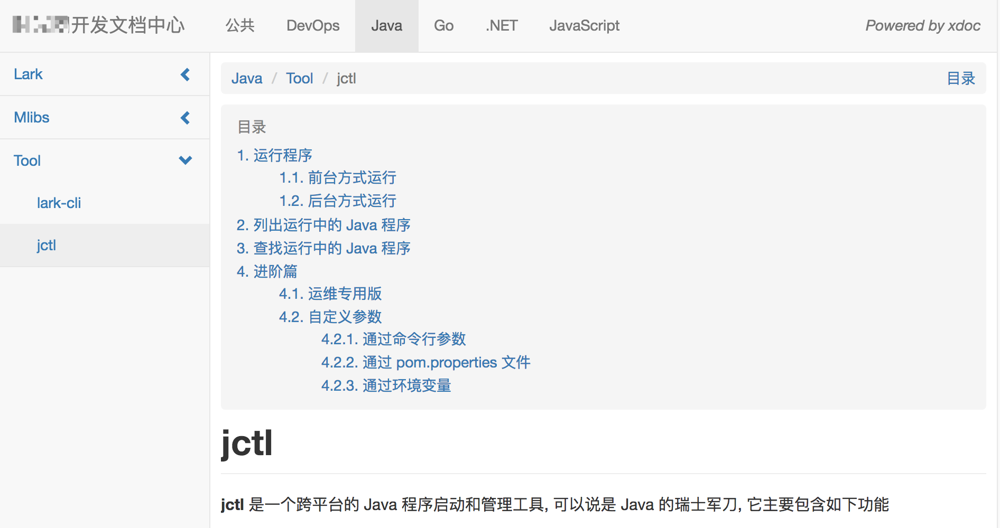

# xdoc

A document site based Markdown.



## Usage

### Standalone

```bash
xdoc -d /docs
```

### Docker

First you need create a new docker image base on `cuigh/xdoc`, copy all your documents to `/docs` directory in image. Here is the sample **Dockerfile** file.

```docker
FROM cuigh/xdoc
COPY . /docs/
```

Build the image

```bash
docker build -t docs .
```

Start the container

```bash
docker run -it -p 8000:8000 docs
```